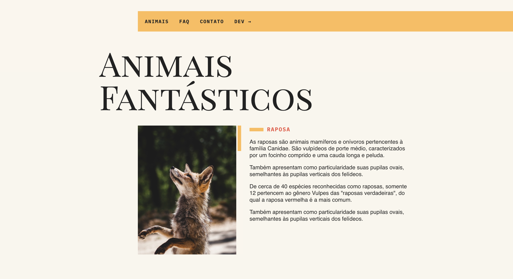

# 🐾 Animais Fantásticos

Projeto desenvolvido durante o curso da **Origamid**, com foco no aprendizado de **JavaScript para iniciantes** e **manipulação do DOM**.

O projeto ainda está em desenvolvimento, pois as aulas continuam sendo aplicadas e novas funcionalidades podem ser adicionadas conforme o avanço no curso.

# 📷 Preview

---

# 🌐 Acesse o Projeto

🔗 **Projeto online**
https://wsfraga.github.io/Animais-Fantasticos/

💻 **Repositório no GitHub**
https://github.com/wsfraga/Animais-Fantasticos

---

# 📚 Sobre o Projeto

O **Animais Fantásticos** é um projeto criado para praticar conceitos fundamentais de **JavaScript**, principalmente a interação com elementos da página utilizando o **DOM (Document Object Model)**.

Durante o curso, diferentes funcionalidades são implementadas para reforçar conceitos importantes do desenvolvimento **Front-End**, como:

* Manipulação de elementos da página
* Eventos com JavaScript
* Estruturação de código
* Interatividade no navegador

---

# 🚀 Tecnologias Utilizadas

* **HTML**
* **CSS**
* **JavaScript**

Outras tecnologias podem ser adicionadas conforme o avanço do curso.

---

# 🎯 Aprendizados

Neste projeto estou praticando:

* JavaScript para iniciantes
* Manipulação do DOM
* Estruturação de código JavaScript
* Interatividade em páginas web
* Organização de projetos front-end

---

# 📌 Status do Projeto

🚧 **Em desenvolvimento**

Este projeto está sendo atualizado conforme avanço nas aulas do curso da **Origamid**.

---

# 👨‍💻 Autor

Feito por **Wesley Fraga**

🔗 GitHub
https://github.com/wsfraga

🔗 LinkedIn
https://www.linkedin.com/in/wesley-fraga-188384392/
